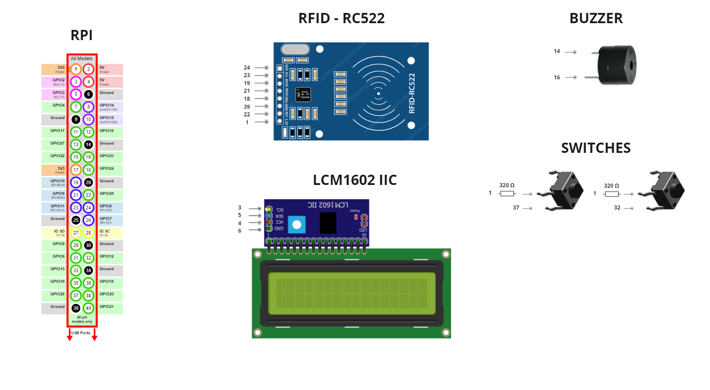
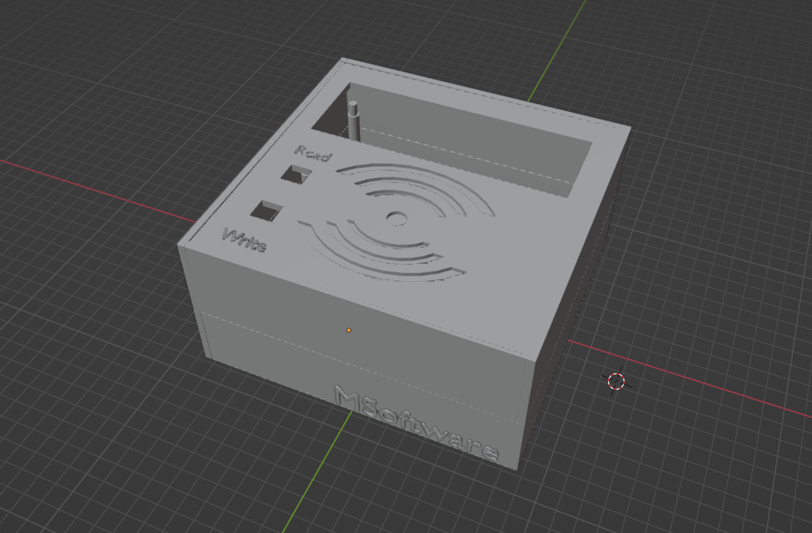
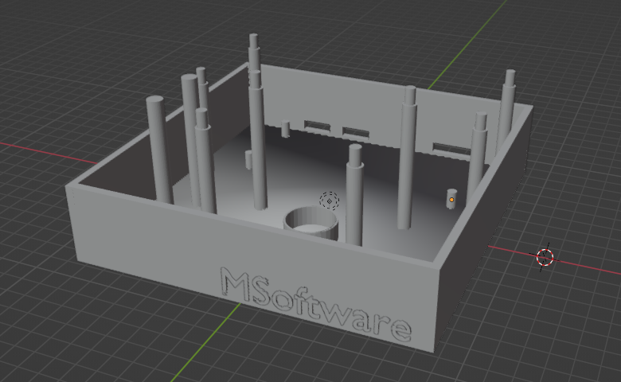
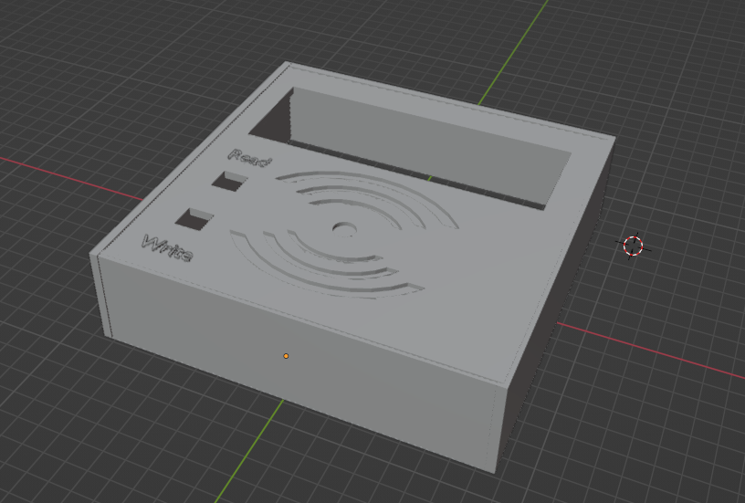

# RFID Copier

DIY project design that allows you to copy RFID cards. RPI with the RC522 module is used to copy cards. As soon as the 
device starts up, the LCD will ask you to write or read the card. It will be possible to write the card only after the 
first reading. The program will keep the card data in memory, which can be copied many times, without the need to read 
it each time. Two buttons are used to select the read or write option.

## Equipment list
- Raspberry Pi Zero
- Micro SD Card
- Micro USB cabel
- RFID-RC522
- LCM1602 with LCD
- RFID Card
- Buzzer
- Switch x2
- 3D case

## Connections
Below is a graphic with a presentation of all the necessary connections to complete the project:

## Preparation of the RPI
Complete instruction for how to prepare your RPI you can find here: [RPI Preparation](rpi_preparation.md)

## Case
Below you can find a complete case for this project with STL files.

The bottom part:

[STL - Bottom Part](utils/stl/rfid_case_bot.stl)

The top part:

[STL - Top Part](utils/stl/rfid_case_top.stl)
