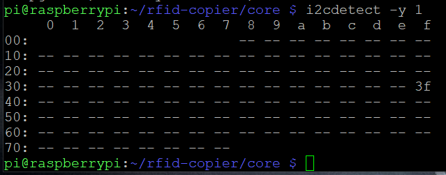
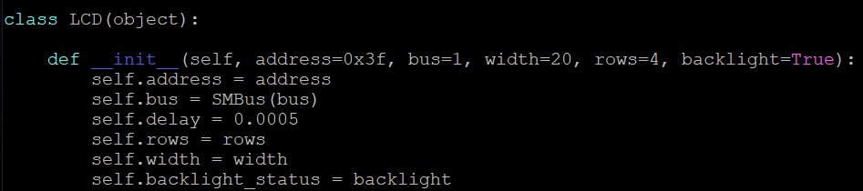

# Preparation of the RPI
## Enable SPI and I2C Interfaces

First we need to enable the SPI. Open the raspi-config:

```
sudo raspi-config
```

Select option number 3: *Interface Options* and press *Enter*. Now select *I4: SPI* and again press *Enter*. You will
be asked if you want to enable the SPI interface, select *Yes* and press *Enter*. Wait a little while for enabling SPI.
You should see on the screen the following text: "*The SPI interface is enabled*". 

Go to *Interface Options* again and this time select *I5: I2C*.

For fully enabled SPI interface and I2C we need to reboot the RPI. Press *ESC* and type the following command:

```
sudo reboot
```

When rebooting is finished, we can check SPI interface is enabled. Run following command:

```
lsmod | grep spi
```

If you see *spi_bcm2835* you can be sure that it worked. In the other case it needs to be changed in config file.
Run following command:

```
sudo nano /boot/config.txt
```

Use *CTRL + W* to find *dtparam=spi=on*. If there is a *#* in front of it, remove it. If you can't find the line at all,
add it to the bottom of the file.

## Prepare Python environment
### Update RPI and install Python
We need to update RPI to be sure we are working on the latest version:

```
sudo apt update
sudo apt upgrade
```

Now we can install Python:

``` 
sudo apt install python3-dev python3-pip
```

And also GIT:

``` 
sudo apt install git
```

### Prepare LCD

The next step is prepare RPI to communicate with LCD. Run following command:

``` 
sudo apt-get install -y python-smbus
sudo apt-get install -y i2c-tools
```

If you want to find LCD address:

``` 
i2cdetect -y 1
```

It should look like this:



When we know the LCD address we need to verify it in script. We can find script location with the command below:

``` 
sudo find /usr/local -name rpi_lcd 2> /dev/null
```

Copy the location and paste it below:

``` 
cd file_path_found
```

If you are in the correct location, you need to open init file:

``` 
sudo nano __init__.py
```

Verify LCD address with address in the init function:



If address is the same you can close the file. If it is different, you need to change it and save the file. 

Last thing is to install all required libraries:

``` 
sudo pip3 install spidev
sudo pip3 install mfrc522
sudo pip3 install rpi_lcd
```

### Prepare repository
We are ready for download repository. Run following command:

``` 
git clone git@github.com:MSoftwaree/rfid-copier.git
```

Go to repository destination:

``` 
cd rfid-copier
```

Install virtualenv package:

``` 
sudo pip3 install virtualenv
```

Create a virtual environment:

``` 
sudo python3 -m virtualenv venv
```

Activate virtual environment:

``` 
source ./python_env/bin/activate
```

RPI and whole repository is prepared for using.
